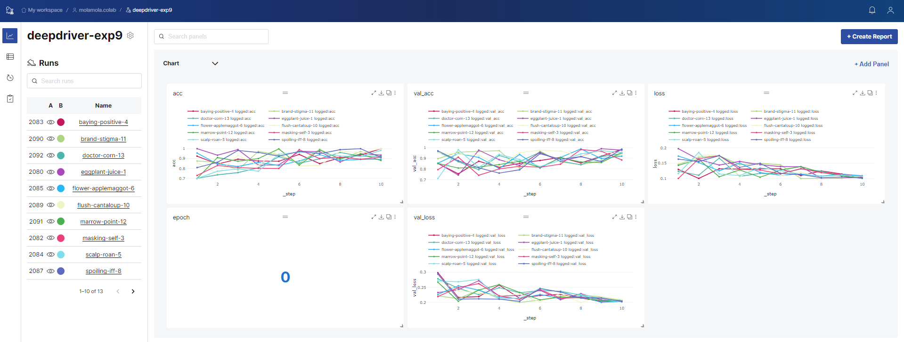
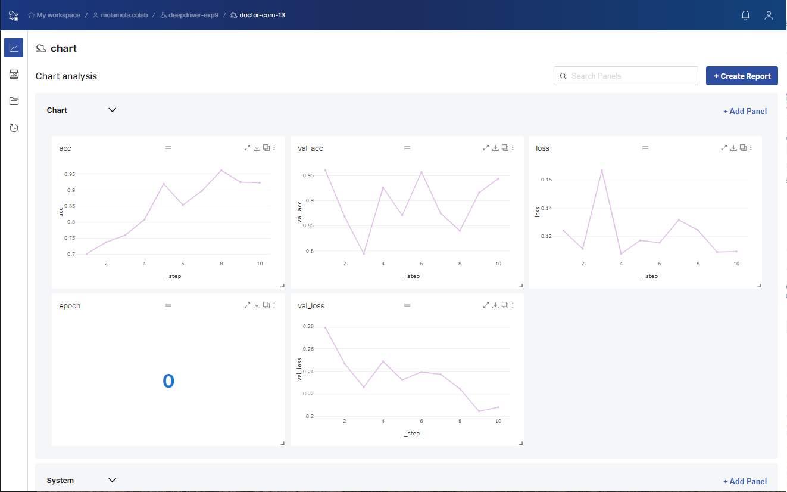
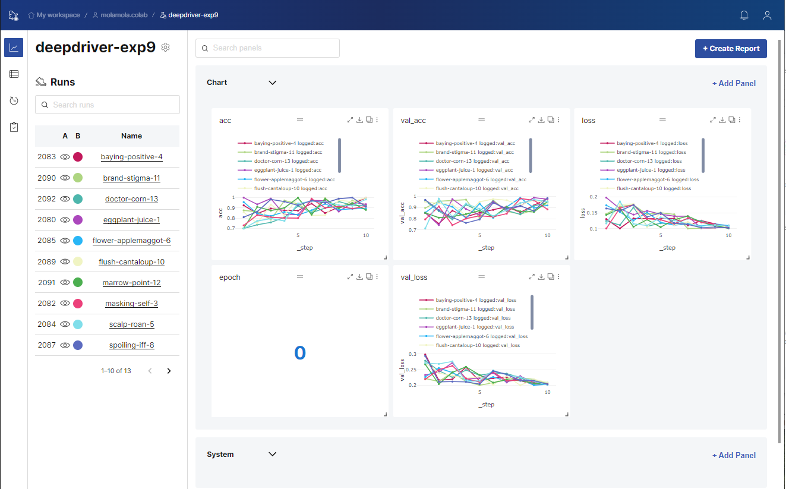

# 📊 dashboard

## 대쉬 보드 접속하기

<figure><figcaption></figcaption></figure>

### 1. 실행 생성 결과의 url로 접속

deepdriver.init()의 수행 결과로서 출력되는 메시지에 "Run URL" 의 주소를 클릭 혹은 브라우저에 붙여 넣어서 이동하기


```bash
Team Name=molamola.colab
Exp Name=deepdriver-exp9
Run Name=doctor-corn-13
Run URL=http://{대쉬보드ip}:9111/experi/molamola.colab/deepdriver-exp9/doctor-corn-13/run/chart
```


#### <mark style="background-color:purple;">실행(run) 페이지 접속 화면</mark>

실행에서 기록한 로그 데이터를 차트로 확인 할 수 있습니다.


로그 데이터 기록시 acc, val\_acc, loss, val\_loss 이름으로 지정한 항목들은 기본적으로 출력됩니다.

( 그 외의 로그들에 대해 차트를 출력하려면Add Panel 버튼을 통해 추가할 수 있습니다 )


<figure><figcaption></figcaption></figure>

### 2. 팀이름과 실험환경 이름으로 url 접속


실험환경의 이름을 아는 경우 하기와 같은 url을 통해 실험환경 페이지로 바로 접속 할 수 있습니다.




https://board.bokchi.com/{팀or \_유저이름}/{실험환경이름}/charts



http://{대쉬보드ip}:9111/experi/{팀이름}/{실험환경이름}/exp/chart



#### <mark style="background-color:purple;">실험환경 페이지 접속 화면</mark>

같은 실험환경 내의 실행(실험)에 대해서 한눈에 결과 비교를 할 수 있습니다.


로그 데이터 기록시 acc, val\_acc, loss, val\_loss 이름으로 지정한 항목들은 기본적으로 출력됩니다.

( 그 외의 로그들에 대해 차트를 출력하려면 Add Panel 버튼을 통해 추가할 수 있습니다 )


<figure><figcaption></figcaption></figure>


실행 이름을 아는 경우 하기와 같은 url을 통해 실행 페이지로 바로 접속 할 수 있습니다.


```
http://{대쉬보드ip}:9111/experi/{팀이름}/{실험환경이름}/{실행이름}/run/chart
```
