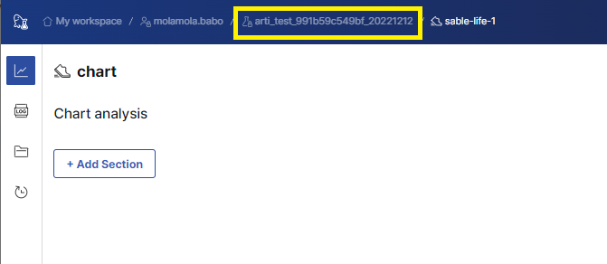
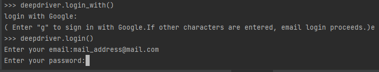

# 🔖 Artifacts versioning


로그인과 실험환경/실행 생성 후에 사용할 수 있습니다.

deepdriver login과 init 후에 사용할 수 있습니다.



동일  아티팩트에 데이터를 추가하여 업로드 하면 새로운 버전이 생성됩니다.


## <mark style="color:blue;">예제 따라하기</mark>



## 1. 아티팩트 가져오기

이전에 아티팩트 업로드를 통해 서버에서 관리되고 있는 아티팩트를 가져옵니다.

```
deepdriver.get_artifact(name="artifact_name",type="artifact_type")
```

### <mark style="background-color:yellow;">example</mark>

아티팩트의 name과 type으로 아티팩트 정보를 가져옵니다.

```
arti = deepdriver.Artifacts(name="sample",type="dataset")
```

아티팩트에 추가되어있는 파일을 확인합니다.&#x20;



```python
print([ent.path for ent  in arti.entry_list])
```


```
['README.md', 'anscombe.json', 'california_housing_test.csv', 'california_housing_train.csv', 'mnist_test.csv', 'mnist_train_small.csv']
```




### 1. dashboard로 이동

#### 1-1. url로 이동

http://{서버ip주소}:9111/{team이름}/experi/{실험환경이름}/exp/chart

#### 1-2. deepdriver.init 수행시 출력된 run url 통해 이동


```
Team Name=molamola.babo
Exp Name=arti_test_991b59c549bf_20221212
Run Name=sable-life-1
Run URL=http://quick-experience.bokchi.com:9111/experi/molamola.babo/arti_test_991b59c549bf_20221212/sable-life-1/run/chart
```



### 2. 실험환경 페이지로  이동

상단의 실험환경이름 클릭( 플라스크 아이콘 )&#x20;

<figure><figcaption></figcaption></figure>


### 3. 아티팩트 탭으로 이동

좌측에 아티팩트 타입과 이름 기준으로 아티팩트 목록이 보이고, 각 아티팩트에는 태그(버전)들이 보입니다.

<figure><figcaption></figcaption></figure>


### 4. 아티팩트 버전별 파일 목록 확인

각 태그(버전)을 누르고 우측에 Files 탭을 누르면 해당 태그로 업로드된 파일 목록을 조회할 수 있습니다.

<figure><figcaption></figcaption></figure>




## 2. 아티팩트 버전 생성

아티팩트에 새로운 데이터를 추가합니다.

```python
arti.add("/content/cat_dog")
```

아티팩트를 업로드 합니다.&#x20;


아티팩트를 업로드하면 아티팩트를 가져 왔을 때의 버전 + 1 로 자동 생성됩니다.

(기존버전이 V1이면 V2로 태그됨)


```
deepdriver.upload_artifact(arti)
```


## 3. 아티팩트 특정 버전 가져오기

가져오려는 아티팩트의 버전을 get\_artifact의 tag를 통해 지정할 수 있습니다.&#x20;

```
deepdriver.get_artifact(name="{artifact_name}",type="{artifact_type}", tag= "{TAG}")
```

#### <mark style="background-color:yellow;">example</mark>

```python
arti = deepdriver.get_artifact(name="sample",type="dataset","V2")
arti.download()
```

##

###

