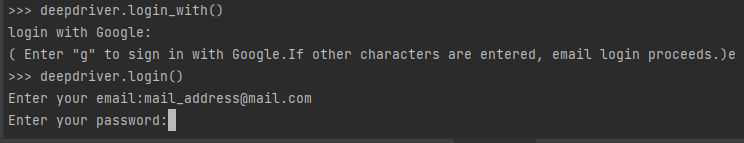

# 🚀 Quickstart

## <mark style="color:blue;">예제 따라하기</mark>



## 1. Set up deepdriver

### 0) Deepdriver 내려받기

deepdriver 대시보드 설치



대시보드 설치 과정 없음.



deepdriver 대시보드 설치



### 1) Deepdriver python library 설치




```
pip install deepdriver
```





```
!pip install deepdriver
```




### 2) 서버 설정 하기&#x20;



별도의 설정 과정 없음



deepdriver server를 설치한 주소로 하기와 같이 설정

```python
import deepdriver
deepdriver.setting(http_host="{your_ip}:9011",  grpc_host="{your_ip}:19051")

# local에 deepdriver server를 설치한 경우 하기와 같이 설정
#deepdriver.setting(http_host="127.0.0.1:9011",  grpc_host="127.0.0.1:19051")
```



## 2. 서버에 로그인 하기




회원가입시 사용한 id와 password로 로그인

일반 이메일로 가입한 경우 email 을 선택하고 google 계정으로 가입한 경우 gmail을 선택 한다&#x20;


### 1. 일반 email로 로그인 하는 경우&#x20;

#### 하기 코드에서 email 선택

```
deepdriver.login_with()
```

#### 하기 코드에서 email과 password 기록

```
deepdriver.login()
```

.png>)

### 2. google 계정으로 로그인 하는 경우&#x20;

#### 하기 코드에서  google 선택

```
deepdriver.login_with()
```

#### 하기 코드 실행 후 생성되는 link를 눌러 google 로그인 후 code 복사하여 입력

```
deepdriver.login()
```

.png>)

### 3. api key로 로그인 하는 경우&#x20;

#### dashboard의 user setting에서 api key 를 복사하여 하기와 같이 로그인

```
deepdriver.login(key="{your api key}")
```






회원가입시 사용한 id와 password로 로그인


### 1. 일반 email로 로그인 하는 경우

#### 하기 코드에서 e 입력

```
deepdriver.login_with()
```

#### 하기 코드에서 id와 password 입력

```
deepdriver.login()
```



### 2. google 계정으로 로그인 하는 경우

#### 하기 코드에서 g 입력

```
deepdriver.login_with()
```

#### 하기 코드 수행 후 link 클릭하여 google 로그인 후 생성된 코드 복사하여 입력

```
deepdriver.login()
```

### 3. api key로 로그인 하는 경우&#x20;

#### dashboard의 user setting에서 api key 를 복사하여 하기와 같이 로그인

```
deepdriver.login(key="{your api key}")
```






<mark style="color:blue;">deepdriver server 설치시 발급받은 사용자의 api key 사용</mark>


```python
deepdriver.login( key="your_api_key")
```




## 3. 실험환경 및 실행 만들기


<mark style="color:blue;">실험환경은 한가지 주제에 대해 여러번의 실험의 로그 및 결과를 기록하고 비교하기 위한 단위 입니다.</mark>

<mark style="color:blue;">실행은 하나의 실험을 의미 합니다.</mark>


```python
deepdriver.init()
```

## 4. 실험로그 기록 하기


인공지능 실험(학습)을 진행하면서 기록해야할 값들을 기록 합니다.

하나의 실험 안에서 여러번 반복적으로 호출 할 수 있습니다.


```python
deepdriver.log({"acc": train_acc ,"loss" : train_loss})
```
